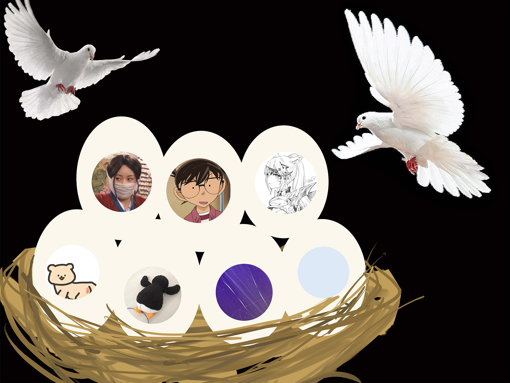

# Week 1 团队展示 & 选题

---

[TOC]

---

## 团队展示

### 队名

这段代码到底哪里不队

### 队员

<table style="text-align: center">
    <tr>
        <td><a href="https://www.cnblogs.com/h-yy/">黄圆圆</a></td>
        <td>3218005440</td>
    </tr>
    <tr>
        <td><a href="https://www.cnblogs.com/qina4/">袁丽玲</a></td>
        <td>3218005444</td>
    </tr>
    <tr>
        <td><a href="https://www.cnblogs.com/asdak/">刘芊羿</a></td>
        <td>3118005416</td>
    </tr>
    <tr>
        <td><a href="https://www.cnblogs.com/WoodenKevin/">王楷楠 [队长]</a></td>
        <td>3118005425</td>
    </tr>
    <tr>
        <td><a href="https://www.cnblogs.com/mortal-cnblogs/">钟景文</a></td>
        <td>3118005434</td>
    </tr>
    <tr>
        <td><a href="https://www.cnblogs.com/sidzwl/">钟文磊</a></td>
        <td>3118005435</td>
    </tr>
    <tr>
        <td><a href="https://www.cnblogs.com/denn/">朱景钊</a></td>
        <td>3118005436</td>
    </tr>
</table>

### 队员风采

-   黄圆圆
    -   风格：好吃懒做
    -   擅长的技术：Java 入门
    -   编程兴趣：后台
    -   希望的软工角色：开发，测试
    -   宣言：知道的都要知道，不知道的慢慢了解
-   袁丽玲
    -   擅长的技术：C JAVA（咸鱼落泪
    -   希望的软工角色：UI 设计、前端
    -   宣言：争取每天打鱼
-   刘芊羿
    -   编程兴趣：Python ，前端
    -   希望的软工角色：开发
-   王楷楠
    -   擅长的技术：HTML, CSS, JavaScript, Vue.js
    -   编程兴趣：前端
    -   希望的软工角色：开发
-   钟景文
    -   风格：发呆
    -   技术：Java
    -   编程兴趣：后台
    -   希望的软工角色：开发
    -   一句话宣言：始于平凡，归于平凡
-   钟文磊
    -   风格：佛系
    -   擅长的技术：擅长 C 和 Java
    -   编程的兴趣：人工智能
    -   希望的软工角色：开发
    -   宣言：我还没秃，我还能能码
-   朱景钊
    -   编程兴趣：Python ，人工智能
    -   希望的软工角色：开发

### 团队分工

<table style="text-align: center">
    <tr>
        <td style="font-weight: bold">设计</td>
        <td>袁丽玲</td>
    </tr>
    <tr>
        <td rowspan="2" style="font-weight: bold">前端</td>
        <td>王楷楠</td>
    </tr>
    <tr>
        <td>黄圆圆</td>
    </tr>
    <tr>
        <td rowspan="4" style="font-weight: bold">后台</td>
        <td>刘芊羿</td>
    </tr>
    <tr>
        <td>钟景文</td>
    </tr>
    <tr>
        <td>钟文磊</td>
    </tr>
    <tr>
        <td>朱景钊</td>
    </tr>
</table>

### 合照

---

## 选题

-   描述：一个能实现多词典打卡的 APP，初期考虑实现英语词典打卡和古诗词打卡。
-   预测用户量：700

---

## 团队计划

<table>
    <tr>
        <td rowspan="3" style="font-weight: bold; text-align: center">第 6 周</td>
        <td>1. 团队组队、团队博客</td>
    </tr>
    <tr>
        <td>2. 团队介绍、成员展示、角色分配、选题确定</td>
    </tr>
    <tr>
        <td>3. 制定团队计划安排、团队贡献分的规定</td>
    </tr>
    <tr>
        <td rowspan="3" style="font-weight: bold; text-align: center">第 7 周</td>
        <td>1. 需求规格说明书</td>
    </tr>
    <tr>
        <td>2. 原型设计，队员估计任务难度并学习必要的技术</td>
    </tr>
    <tr>
        <td>3. 编码规范完成、平台环境搭建完成、初步架构搭建</td>
    </tr>
    <tr>
        <td rowspan="3" style="font-weight: bold; text-align: center">第 8 周</td>
        <td>1. 原型改进（给目标用户展现原型，并进一步理解需求）</td>
    </tr>
    <tr>
        <td>2. 架构设计，WBS，团队成员估计各自任务所需时间</td>
    </tr>
    <tr>
        <td>3. 测试计划</td>
    </tr>
    <tr>
        <td rowspan="2" style="font-weight: bold; text-align: center">第 9~10 周</td>
        <td>1. 团队项目 Alpha 任务分配计划</td>
    </tr>
    <tr>
        <td>2. 连续 7 天的 Alpha 敏捷冲刺，7 篇每日 Scrum Meeting 博客以及代码提交</td>
    </tr>
    <tr>
        <td rowspan="3" style="font-weight: bold; text-align: center">第 11 周</td>
        <td>1. 用户反馈、测试计划改进</td>
    </tr>
    <tr>
        <td>2. 团队 Alpha 阶段个人总结</td>
    </tr>
    <tr>
        <td>3. 团队项目 Alpha 博客：发布说明、测试报告、展示博客、项目管理</td>
    </tr>
    <tr>
        <td style="font-weight: bold; text-align: center">第 12 周</td>
        <td>1. 团队项目 Alpha 博客：事后分析</td>
    </tr>
</table>

---

## 团队绩效

成员的绩效 = 团队获得的分数 + 个人的团队贡献分。
在项目 alpha 和 beta 阶段评审后，团队会得到一个项目分数；每个成员都会得到同样的分数，做为自己的原始分数的一部分。
**所有人的团队贡献分总和为 140 分**，并按以下规则进行分配：

1. 将每个人 **分配的任务量** 、 **分配的任务难度** 、 **任务完成情况** 分别进行等级划定。**等级一共有 5 级**，即 1~5 。等级划定由**组内互评**产生。
2. 根据 3 个等级计算个人最终得分，计算方式为：
   **[分配的任务量] × 30% + [分配的任务难度] × 30% + [任务完成情况] × 40%**
3. 根据个人得分对团队贡献分进行分配。
